# atlantis 시도기

[https://www.runatlantis.io/](https://www.runatlantis.io/)

atlantis는 Git의 pull request로 terraform을 배포할 수 있도록 도와주는 도구입니다.

즉, Git에서 terraform plan과 apply를 실행할 수 있다는 것입니다!

여러 pull request들간의 충돌도 사전 감지해서 문제를 방지해주며,

쉽고 편하게 terraform 코드와 tfstate를 관리할 수 있다는 장점이 있습니다.

-----

## 맛보기

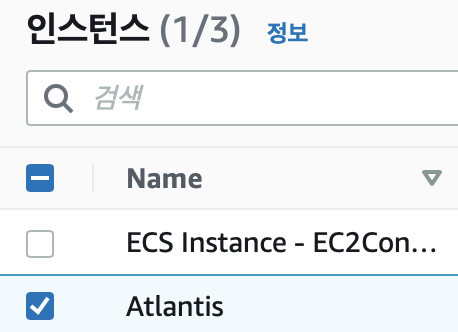

atlantis를 설치할 EC2를 생성했습니다.

os는 ubuntu 20 입니다

### atlantis 설치

```sh
wget https://github.com/runatlantis/atlantis/releases/download/v0.18.2/atlantis_linux_amd64.zip
mv atlantis_linux_amd64.zip atlantis.zip
sudo apt-get install unzip
unzip atlantis.zip
rm -rf atlantis.zip

./atlantis testdrive
```

위 명령어를 실행하여 Atlantis가 구동될 수 있는 환경인지 테스트 해봅니다

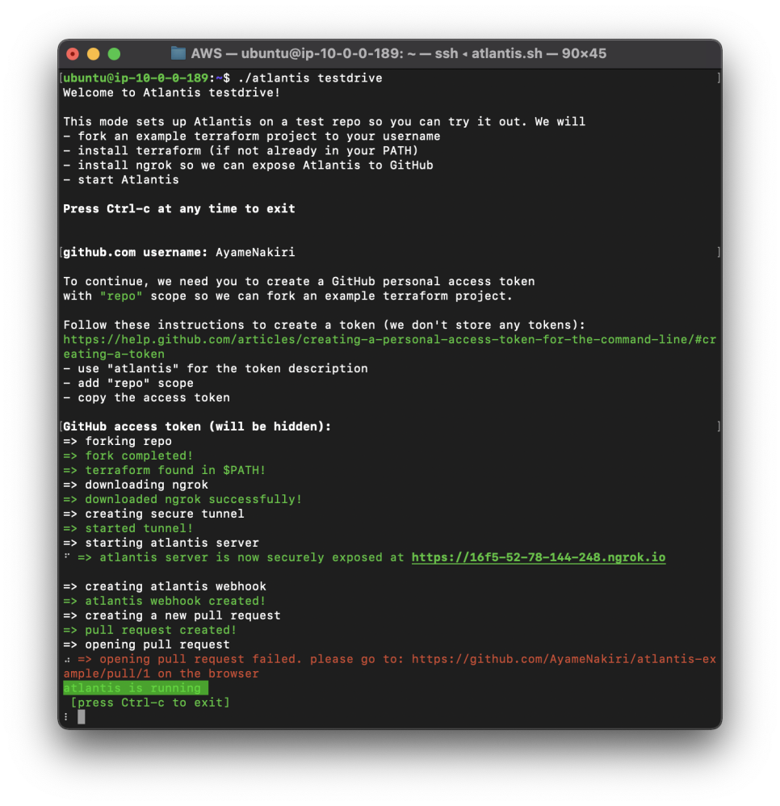

[https://github.com/AyameNakiri/atlantis-example/pull/1](https://github.com/AyameNakiri/atlantis-example/pull/1)

명령어 실행시 예시 레퍼지토리를 포크하고, 예시 PR을 만들어줍니다

PR이 잘 만들어져있고, 정상적으로 동작한다면 OK

## Atlantis 설치


```sh
sudo mv ./atlantis /user/local/bin/atlantis


atlantis server --gh-token="GITHUB ACCESS KEY" --gh-user="AyameNakiri" --repo-allowlist="github.com/rhea-so-lab/*" --repo-config=atlantis.yaml --enable-policy-checks --automerge
```

```yml
# atlantis.yaml
policies:
  conftest_version: 0.23.0
  owners:
    users:
    - qwer
  policy_sets:
  - name: null_resource_warning
    path: /home/ubuntu/null_resource_warning/
    source: local
```

막히거나 잘 안되는게 있다면 아래 글들을 읽어보세요

[https://turtle1000.tistory.com/99](https://turtle1000.tistory.com/99)

[​https://www.runatlantis.io/docs/configuring-webhooks.html#github-github-enterprise](​https://www.runatlantis.io/docs/configuring-webhooks.html#github-github-enterprise)


[https://github.com/rhea-so-lab/Infrastructure-as-Code/pull/8](https://github.com/rhea-so-lab/Infrastructure-as-Code/pull/8)

Atlantis가 잘 실행되었다면, GitHub에 Webhook을 설정해 Atlantis가 동작하도록 해줍니다

-----

## Terraform 연동

### aws cli 설치

```sh
sudo apt-get install awscli
aws configure
```

### terraform 설치

[https://learn.hashicorp.com/tutorials/terraform/install-cli](https://learn.hashicorp.com/tutorials/terraform/install-cli)

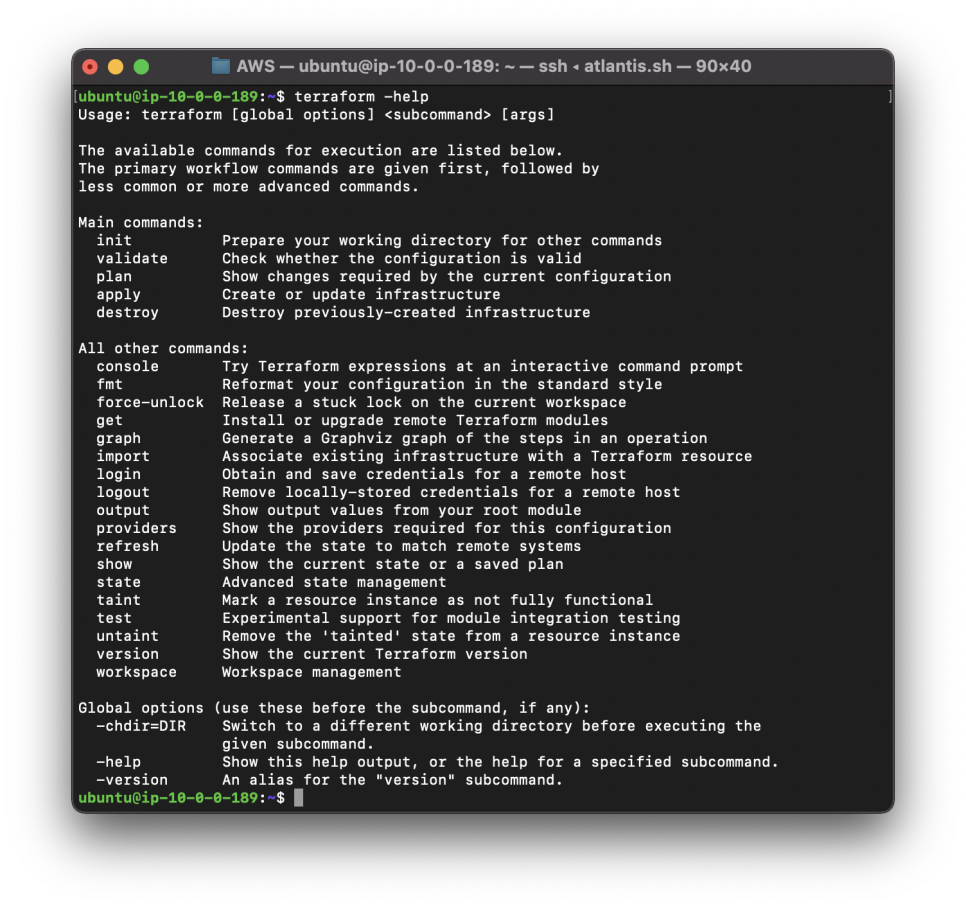

Terraform을 설치하고, 로그인까지 해줍니다

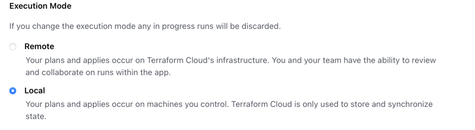

Execution Mode도 설정하는거 잊지마세요

## EC2 생성 해보기

[https://github.com/rhea-so-lab/Infrastructure-as-Code/pull/12](https://github.com/rhea-so-lab/Infrastructure-as-Code/pull/12)

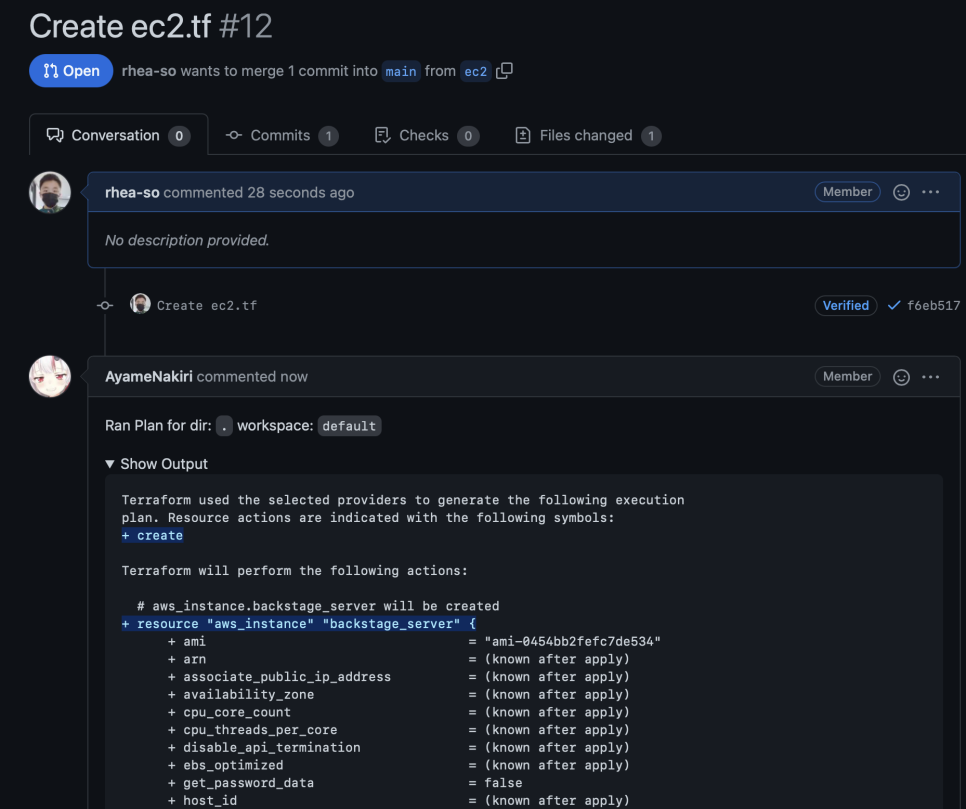

aws_instance를 create 한다는 것을 알려줍니다

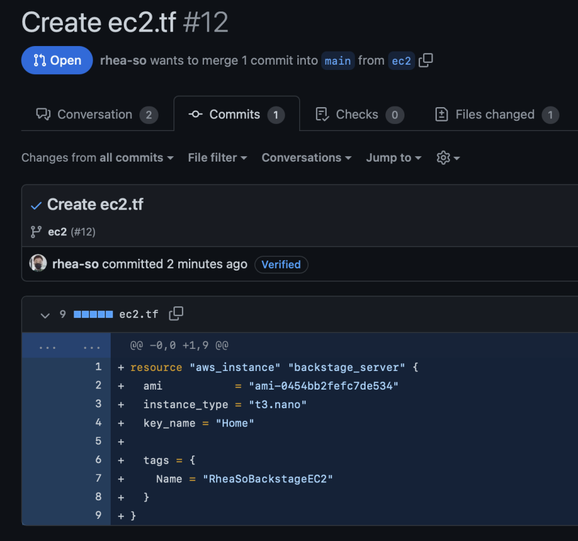

예시 PR의 내용은 이렇습니다

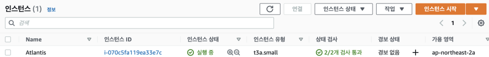

atlantis apply를 하기 전에는 EC2가 없습니다

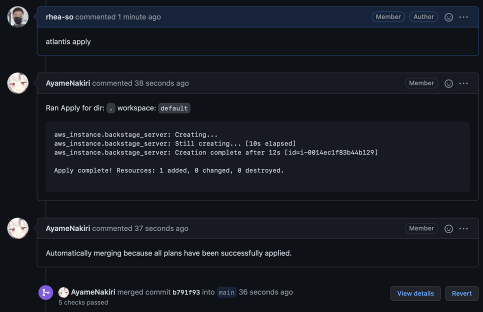

atlantis apply를 하면?

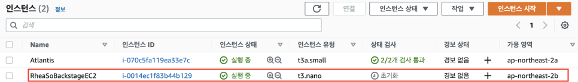

EC2가 생성됩니다!

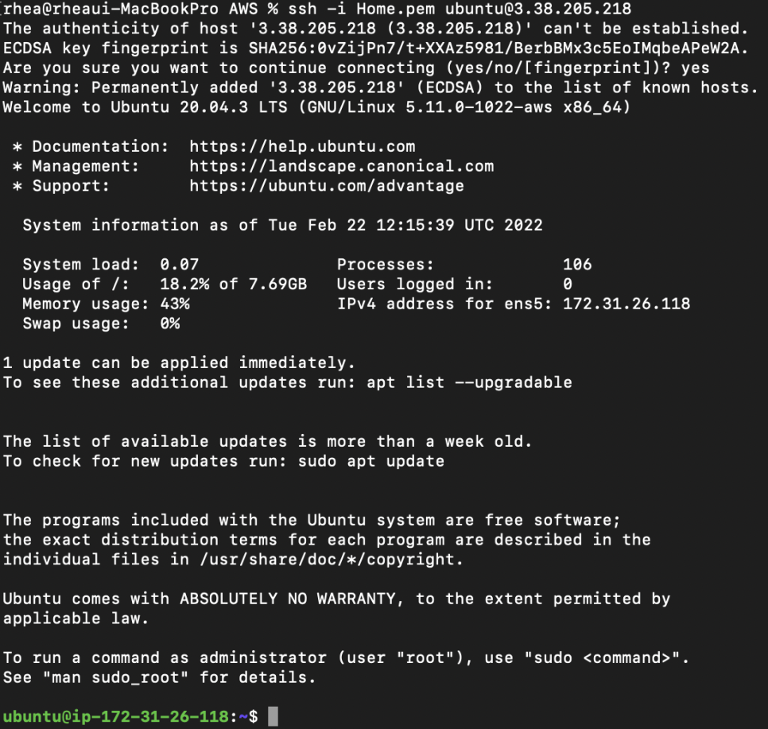

[https://github.com/rhea-so-lab/Infrastructure-as-Code/pull/13](https://github.com/rhea-so-lab/Infrastructure-as-Code/pull/13)

접속도 잘됩니다

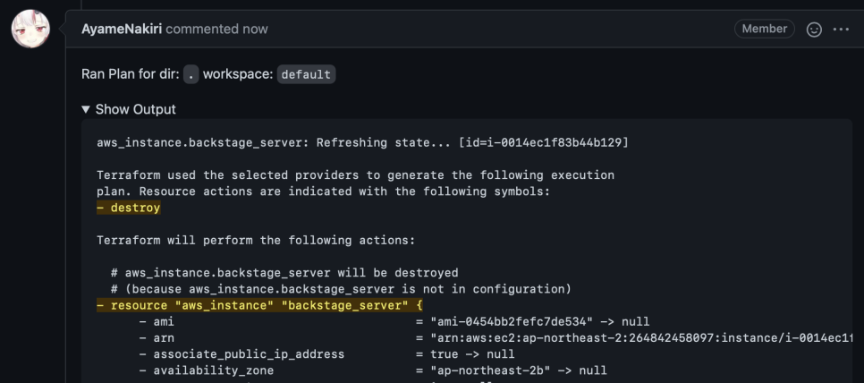

반대로 제거도 잘 되는지 확인해보겠습니다

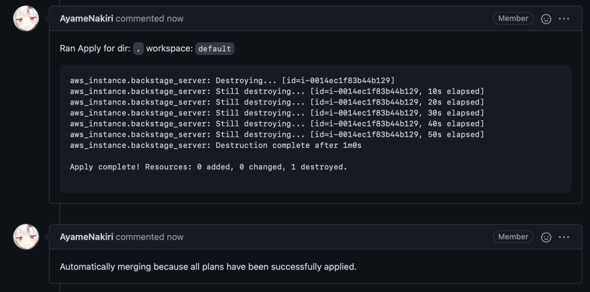

제거 시도!


ssh 연결이 끊어졌습니다

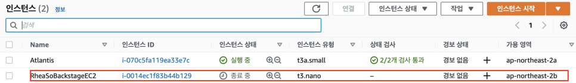

EC2가 잘 종료되네요 ㅎㅎ

## Atlantis 를 데몬으로 등록하여 꺼지지 않게 하기

```system
[Unit]
Description=Atlantis Server

[Service]
Type=simple
ExecStart=/home/ubuntu/run_atlantis.sh
Restart=on-failure

[Install]
WantedBy=multi-user.target
```


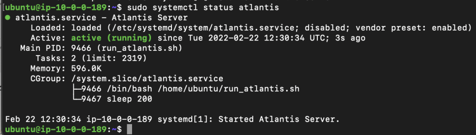

​[https://chhanz.github.io/linux/2019/01/18/linux-how-to-create-custom-systemd-service/](https://chhanz.github.io/linux/2019/01/18/linux-how-to-create-custom-systemd-service/)

[https://registry.terraform.io/providers/hashicorp/aws/latest/docs](https://registry.terraform.io/providers/hashicorp/aws/latest/docs)

systemctl 에 등록해서 터미널에 나가더라도 Atlantis Server는 계속 실행되도록 조치해두면 좋습니다
