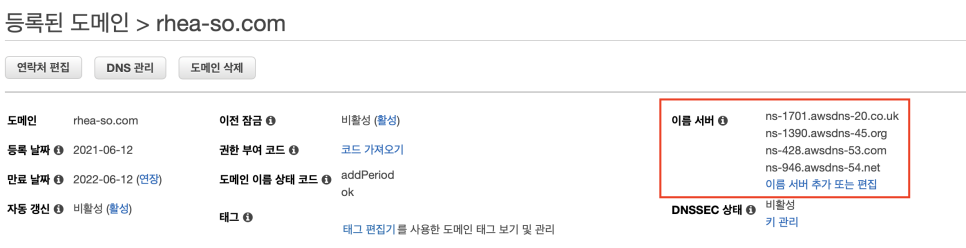
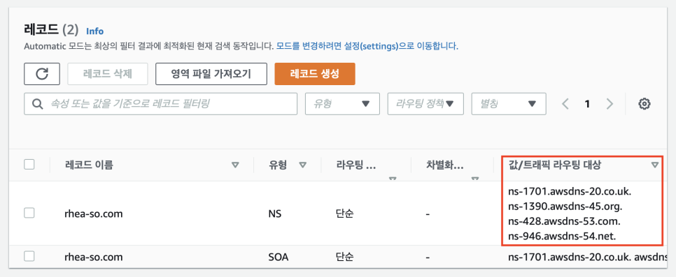

# terraform에서 만든 route53에 연결할 수 없는 경우

## 상황

① AWS에서 도메인을 구입을 했습니다.

② 아래 Terraform 코드를 돌리면, Route53에 Zone과 Domain이 생성됩니다.

```hcl
resource "aws_route53_zone" "domain" {
  name = "rhea-so.com"
}

resource "aws_route53_record" "domain" {
  zone_id = aws_route53_zone.domain.zone_id
  name = "rhea-so.com"
  type = "A"
  ttl = var.ttl
  records = ["52.78.144.248"]
  allow_overwrite = true
}
```

생성은 잘 되었는데..

이상하게 접속해도 도메인을 찾을 수 없다는 에러만 계속해서 발생합니다!!

## 원인 및 해결 방법



AWS 도메인에 보면 이름 서버가 명시되어있는데,

이 값이 Terraform을 통해 만들어진 Zone과 서로 달라서 발생한 문제였습니다.



Zone에 명시되어있는 이름 서버 주소를 AWS 도메인에 설정해주면 문제는 해결됩니다!
