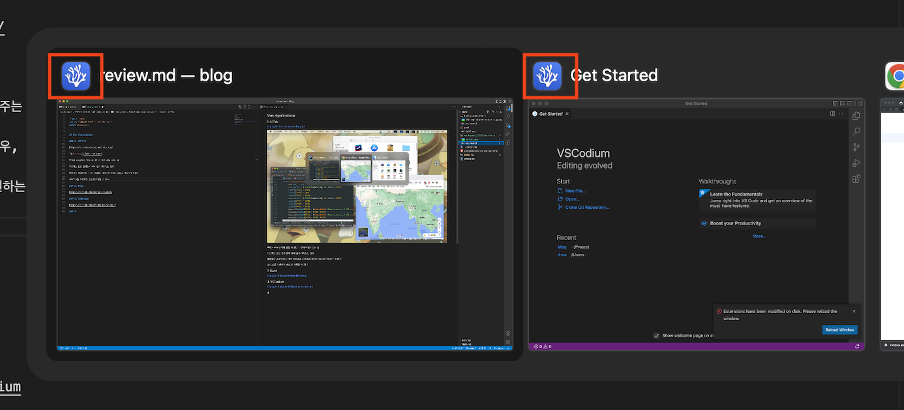
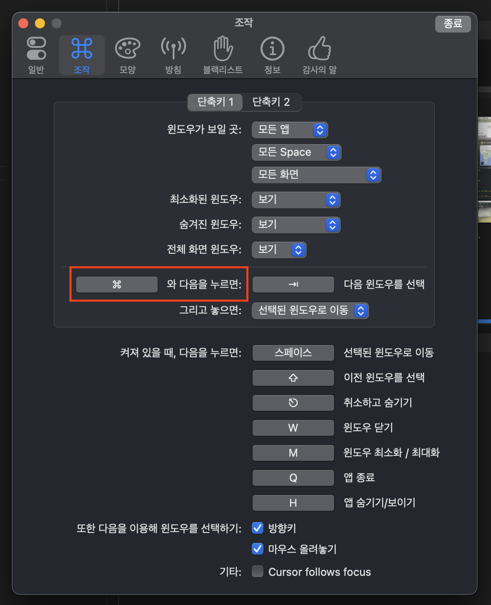
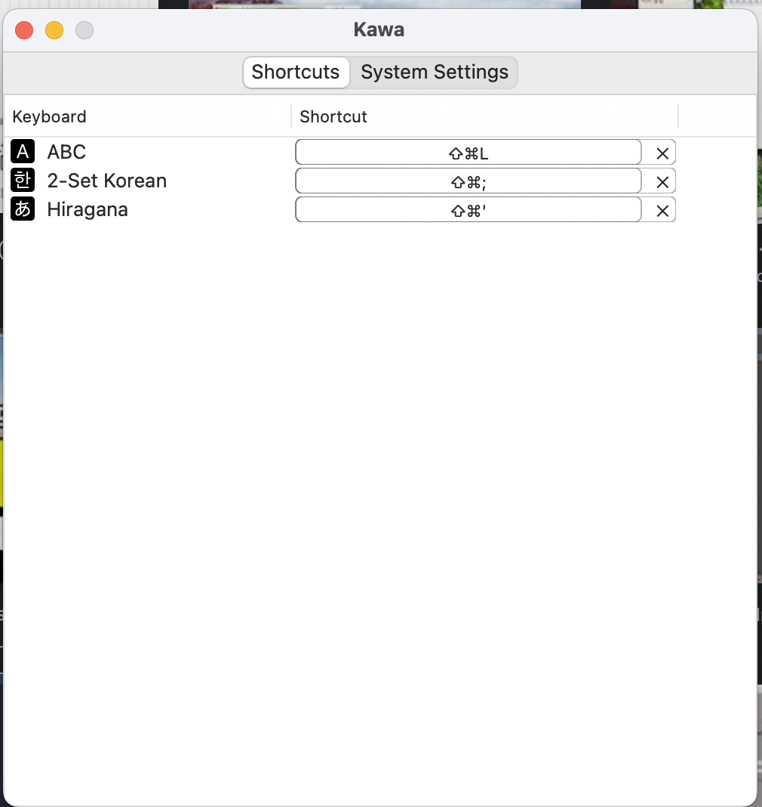

개발시 사용중인 도구들

## Software - Mac Applications

### 1. AltTab

[https://alt-tab-macos.netlify.app](https://alt-tab-macos.netlify.app)

맥을 사용하기 이전, 윈도우를 많이 사용한 나에게 있어서 맥의 "미션 컨트롤"이라는 기능은 굉장히 불편하다

(숙련도의 문제일 수 있음) 내가 겪는 문제점들은 다음과 같다

* 원하는 탭으로 바로 이동할 수 없음
* 무슨 탭을 띄워놓았는지 한눈에 파악이 안됨
* 애니메이션이 너무 화려함
* 빠릿빠릿하지 않아 굉장히 답답함

이 문제를 해결하기 위해 오픈소스로 누군가가 윈도우의 탭 전환 기능을 맥에 똑같이 구현해놓았다

이처럼, 맥에서 윈도우처럼 탭을 관리할 수 있게 만들어준다

기존에는 같은 앱이면서 여러 탭이 켜져있는 경우, 

애플에서 제공해주는 "미션 컨트롤"을 사용하면 이렇게 보이는데

AltTab을 사용하면 이렇게 보인다

굉장히 단순명료하고, 빠릿빠릿하고, 사용하기 편하다

창 크기도 일정해서 보기 좋고 탭을 누르거나 탭에 마우스를 올리면 바로 띄워주기 때문에 사용 경험이 아주 만족스럽다

Command + Tab 을 단축키로 지정하면 윈도우를 쓰는 듯한 착각을 불러일으킨다

### 2. Kawa

[https://github.com/hatashiro/kawa](https://github.com/hatashiro/kawa)

개발하면서 테스트 코드에 일본어를 써야하는 케이스를 겪었는데,

이떄 일본어 자판으로 바꾸기 위해 Option + Space 였나.. 이를 두번 이상 반복해야하는 문제가 생겼고,

한 / 영 / 일 키보드를 한 커맨드로 동시에 다루기는 도무지 쉽지 않았다

Kawa를 사용하면, 특정 커맨드를 특정 키보드로 연결시키는 것이 가능해진다

나는 이렇게 설정해서 한 / 영 / 일 키보드를 자유자재로 다루고 있다

### 3. VSCodium

[https://github.com/VSCodium/vscodium](https://github.com/VSCodium/vscodium)

VSCode에서 Microsoft로 데이터를 보내는 기능들을 제거 후 포팅한 버전

VSCode랑 똑같은데 좀 더 가볍다고 보면 될 것 같다

체감상 VSCode 보다 빠르고 가벼워서 좋았다

실제로는 똑같은 속도인데 심리적으로 더 좋다고 느끼는 것인지는 잘 모르겠다

Microsoft에 내 정보를 안보내므로 안심이 되기 때문에 이것 하나만으로도 쓸 메리트는 충분히 있는 것 같다